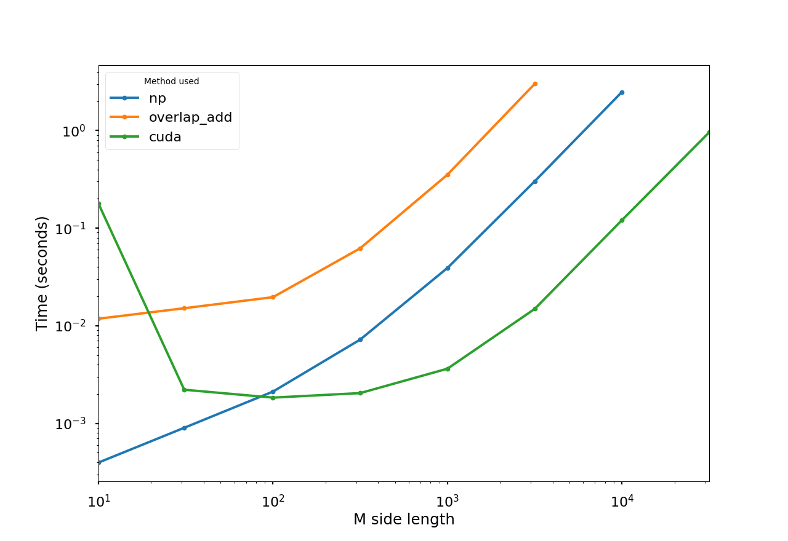

This is a programming exercise I did for a prospective employer as part of their interview process, where I used PyCUDA and NumPy, and to a lesser extent Pandas, signals, timer functions, and MatPlotLib. (I'm not mentioning the employer's name, so other applicants won't find this repo and they can still use the exercise.)

The task was to find the convolution of a big matrix *M* of random numbers with a short vector, both horizontally and vertically. After computing those two convolved matrices, I had to compute and output the minimum and maximum of each.

The file [main.py](main.py) takes the x and y dimensions of *M* and outputs the minimum and maximum. [plot_times.py](plot_times.py) plots the times taken by the three methods I implemented. [pycuda_fns.py](pycuda_fns.py), [numpy_fns.py](numpy_fns.py), and [overlapadd2_fn.py](overlapadd2_fn.py) implement the methods.

I wrote three Python functions for computing the convolutions:
* A version using PyCUDA. Each GPU thread produces one entry of Dx or Dy. This lets us do each convolution using around 3*min(1, xy/g) parallel rounds of multiplications or additions, where g is the number of GPU cores; if the GPU is big enough to give each output entry its own thread, we need only 3 parallel operations.
* A version using numpy.convolve. As far as I can tell, NumPy implements this with a multithreaded for-loop. ([Here](https://github.com/numpy/numpy/blob/30d8feec54abc180979a7db8df07150cfae5201f/numpy/core/src/multiarray/multiarraymodule.c#L1190) is NumPy's C implementation of correlate(), which it uses to compute convolutions.) Each output value needs two multiplications and an addition, so the number of serial multiplications and additions needed is 3xy, where x and y are dimensions of M, ignoring the fact that Dx and Dy are bigger than M, and assuming threads are effectively run in series. Extra memory (above storing M, K, Dx, Dy) is tiny, a couple bytes per thread depending on how you count them. NumPy's convolve is 1D, so I just loop over all the rows/columns to create Dx and Dy.
* A version using [the overlap-add method](https://en.wikipedia.org/wiki/Overlap%E2%80%93add_method). I used [this](https://gist.github.com/fasiha/1c46cf98b6b43967b139#file-overlapadd2-py) implementation by Fasiha on GitHub. This uses the fast Fourier transform to speed up the convolution for large matrices. The FFTs (on all rows/columns of M, and on K) take time Θ(n log n) where n is the length of the rows/cols, then we have to multiply pointwise and invert the FFT; the overlap-add method does this for small strips of the arrays at a time. A disadvantage is that the FFT works with floating-point values, so we have to round them and cast back to integers. If there are memory restrictions then it would be infeasible to do the FFT on the whole thing, since we can't have a big matrix of floats, but with the overlap-add method we could reduce the memory needed by adjusting the strip sizes used.

I ran all three of these methods on an AWS EC2 p2.xlarge instance (since my laptop doesn't have a good GPU), and timed the results, which you can see below. Runs that took longer than 10 seconds or ran out of memory were terminated, with datapoints left out. None of the methods had enough memory for a 100,000x100,000 array, though you could modify the PyCUDA function to split up M into blocks and only load one block into the GPU at a time, which would let you handle larger matrices. As you can see, PyCUDA is faster by a factor of about 10 than the NumPy method, when M is large. The overlap-add method doesn't do well here, but I suspect it would do better if the filter matrix were longer (here it's only a vector of length 3).

I also wrote the min/max functions, with the usual linear-time streaming algorithm (NumPy's ndarray.min/.max) and also with PyCUDA (which does them using the parallel-reduction technique, for log(n) parallel rounds; [here](https://github.com/minrk/PyCUDA/blob/master/pycuda/reduction.py#L345) is PyCUDA's implementation). The time for min/max isn't included in the plot since the interviewer didn't ask for it.

In practice, one could also consider implementing all this on an ASIC or an FPGA - either of those could be set up to do the whole computation in parallel at once, or through strip-mining if the array's too big, and probably much faster than a general-purpose computer. A while back, for my EE180 class, I wrote a Verilog program to make an FPGA apply a matrix convolution (Sobel filter) to images using a shift register, which is quite similar to this coding exercise.
